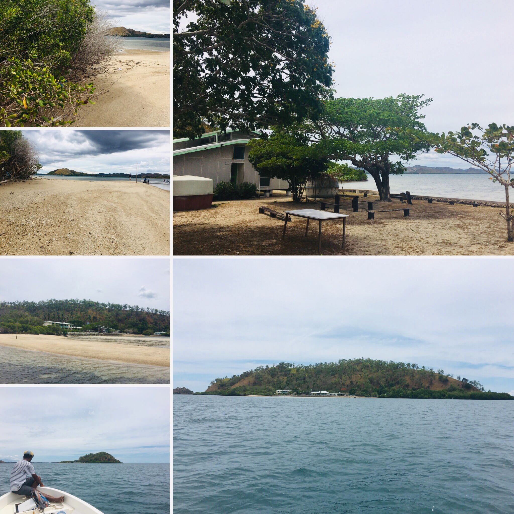

### 12th - 14th September 2019

**First International Workshop on BRIdging the Divides with Globally Engineered Software (BRIDGES2019)**

## About
The objective of the International Workshop on BRIdging Divides with Globally Engineered Software (BRIDGES) is to foster development by providing a forum where researchers and practitioners can report on and discuss issues and solutions to bridge the digital divide of information within a practical geographic-free global software engineering setting.

The workshop encourages the exchange of ideas within the local and international community with its ultimate goal to make software engineering universal; for anyone, anywhere, without any technical, cultural and educational boundaries. This involves a round-table discussion with invited talks from both local and international participants.

## International Participants
- [President Yokoya, NAIST Japan](http://www.naist.jp/en/about_naist/president/profile.html) 
- [Dr. Marco Aurelio Gerosa, Northen Arizona University, USA](https://www.ime.usp.br/~gerosa/) 
- [Dr. Igor Steinmacher, Northen Arizona University, USA](https://nau.edu/school-of-informatics-computing-and-cyber-systems/faculty/igor-steinmacher/) 
- [Dr. Sebastian Baltes, University of Adelaide Australia](https://empirical-software.engineering/) 
- [Dr. Raula Gaikovina Kula, NAIST Japan](https://raux.github.io/)
- [Dr. Christoph Treude, University of Adelaide Australia](http://ctreude.ca/)
- [Dr. Hideaki Hata, NAIST Japan](http://isw3.naist.jp/~hata/)
- Prof. Kenichi Matsumoto, NAIST Japan
- Mr. Goro Watanabe, NAIST Japan

## Local Participants
- University of Papua New Guinea
- Papua New Guinea Science and Technology Secretariat
- Papua New Guinea Digital Cluster
- Kina Bank
- STEM
- Pacific Adventist University
- National High Schools

## Organizers 
- Raula Gaikovina Kula (Organizer, Nara Institute of Science and Technology)
- Christoph Treude (Organizer, University of Adelaide)
- Hideaki Hata (Organizer, Nara Institute of Science and Technology)
- John Genolagani (Local, University of Papua New Guinea)
- Sharon Torao-Pingi (Local, University of Papua New Guinea)

Due to limited space availability, DAY2 and DAY3 attendance at the workshop is by invitation only.

## Venue
BRIDGES2019 will take place at a conference room at the University of Papua New Guinea (UPNG), Waigani Campus (Day 1) and Motupore Island Research Center (Day 3), which is located on an island off the coast of Port Moresby, capital of Pacific nation, Papua New Guinea (PNG). Known as the land of unexpected, locals speak over 850 languages and have a diverse culture, flora and fauna (like the Bird of Paradise and the world's largest butterfly, the Queen Alexandra Birdwing), making PNG one of the last untouched locations on the planet. With independence day looming on September 16th, we expect the area to be buzzing with pacific-style culture and experiences. 

## Program
**DAY 1 - University of Papua New Guinea: Lecture Hall.**

Session | Details
------------ | -------------
morning (9.30am - 12pm)| Welcome addresses from government officials, industry, and educators as well as introduction of the workshop theme.
.. |  **Opening Talk** (President Yokoya)
.. |  **Theme of BRIDGES** (Organizing - Raula Gaikovina Kula)

afternoon (2pm - 4.30pm)| Invited talks by International Researchers.
.. |  **Chatbots** (Dr. Marco Aurelio Gerosa)
.. |  **Diversity and social aspects of open source software communities** (Dr. Igor Steinmacher)
.. |  **Software Developers' Work Habits and Expertise** (Dr. Sebastian Baltes)

**DAY 2 - Motupore Island Research Center: Conference Room.**

Session | Details
------------ | -------------
morning (9.30am - 10:30am)| Recap discussions from Day 1 and design of breakout sessions.

**DAY 3 - Motupore Island Research Center: Conference Room.**

Session | Details
------------ | -------------
morning (9.30am - 12pm)| Breakout groups to discuss unique challenges for software engineering students, educators, and industry in Papua New Guinea
afternoon (2pm - 4.30pm) | Breakout groups to discuss potential solutions to the challenges
wrap-up (5pm - 5.30pm) | Wrap-up and plans for the next instance of BRIDGES

## Travel
To get to Port Moresby, the national airline, Air Niugini, operate weekly direct flights from the capital city to many domestic and international destinations including Singapore, Tokyo, Sydney, Brisbane, Cairns, Manila and Hong Kong. A visa is required to visit PNG, though passport holders from many countries are eligible for a 60-day visa on arrival for free at Port Moresby airport. 

<iframe src="https://www.google.com/maps/embed?pb=!1m18!1m12!1m3!1d125932.71912184669!2d147.1544731256938!3d-9.474114003519416!2m3!1f0!2f0!3f0!3m2!1i1024!2i768!4f13.1!3m3!1m2!1s0x69024a74e29ae88d%3A0x69e6ee3ec6e02d7b!2sMotupore+Island!5e0!3m2!1sen!2sjp!4v1555982574073!5m2!1sen!2sjp" width="400" height="450" frameborder="0" style="border:0" allowfullscreen></iframe>

Papua New Guinea used to be lesser-known to the world, but now it's rapidly opening up to more intrepid travelers with its unique topography and enchanting natural scenery.  
